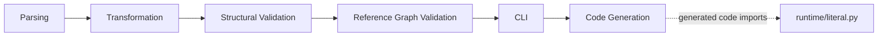

# The Define Programming Language

This directory contains the implementation, specification, documentation, and
tests of a programming language called "Define."

## Spec

- The specification for the language is in `spec/spec.md`. Only implement
  behavior if the spec says to do so.
- If I instruct you to implement behavior that isn't in the spec, do not
  research the codebase to find another spec. Instead, confirm with me that that
  is what I actually want.
- When updating `spec/spec.md`, follow the instructions written in the comment
  at the top of the file.

## Proposals

- The `proposals/` directory contains the reasoning for _why_ the language works
  the way it does. It does not contain normative instructions. Only the spec
  contains normative instructions. Only read proposals when necessary.
- If you read a proposal and it conflicts with the spec in a way you can't
  resolve, bring that to my attention.

## Compiler Codebase Structure

### High-Level Flow

## Grammar

- When updating the grammar, use EBNF instead of regex.

## Parser

- Before changing the functionality of the parser, update the tests in
  `compiler/parser_tests` first, or write a new test in the same style if you
  are adding totally new functionality.

## Transformer

- The transformer turns the parse tree into an AST.

## Validator

- The validator checks syntax that the parser can't check, and it also checks
  semantics.

## Driver

- The Driver is the class that represents the compiler overall.
- When changing functionality in `compiler/driver.py` itself that creates new
  functionality, first update `compiler/driver_test.py`.
- When changing functionality `Driver.run`, first update
  `compiler/driver_run_test.py`.

## Fuzz Test

- The fuzz test (`compiler/driver_fuzz_test.py`) is tagged `manual` and does not
  run with `bazelisk test //...`. Run it explicitly with
  `bazelisk test //define/compiler:driver_fuzz_test` after changes to the
  parser, transformer, validator, or error classification code.
- Update the fuzz test's code genration when the syntax or semantics of the
  language change, so that the generated inputs remain representative of valid
  and near-valid Define source.
- When a fuzz test failure reveals a bug, add a targeted unit test for the
  affected component (parser, transformer, or validator) that reproduces the
  specific issue before fixing it.

## Implementation Sequence

- When I ask you to implement an entirely new language feature, first update
  only the grammar, the parser test, and the parser.
