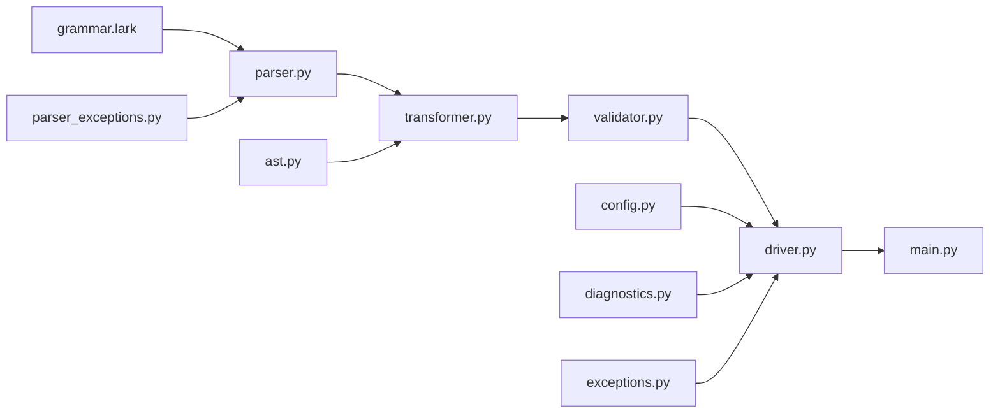

# The Define Programming Language

This directory contains the implementation, specification, documentation, and
tests of a programming language called "Define."

## Spec

- The specification for the language is in `spec/spec.md`. Only implement
  behavior if the spec says to do so.
- If I instruct you to implement behavior that isn't in the spec, do not
  research the codebase to find another spec. Instead, confirm with me that that
  is what I actually want.
- When updating `spec/spec.md`, follow the instructions written in the comment
  at the top of the file.

## Proposals

- The `proposals/` directory contains the reasoning for _why_ the language works
  the way it does. It does not contain normative instructions. Only the spec
  contains normative instructions. Only read proposals when necessary.
- If you read a proposal and it conflicts with the spec in a way you can't
  resolve, bring that to my attention.

## Compiler Codebase Structure

## Grammar

- The grammar for the language is in `compiler/grammar.lark`.
- When updating the grammar, use EBNF instead of regex.

## Parser

- The parser is in `compiler/parser.py`. Before changing the functionality of
  the parser, update the tests in `compiler/parser_tests` first, or write a new
  test in the same style if you are adding totally new functionality.
- The parser test does not depend on any files on the disk. It does not use
  `testdata/`. It does not use parameterized tests.

## Transformer

- The transformer turns the parse tree into an AST. The transformer is in
  `compiler/transformer.py`, the AST is in `compiler/ast.py`, and they both have
  tests.

## Validator

= The validator checks syntax that the parser can't check. It also checks
semantics. It is `compiler/validator.py`. Its test is
`compiler/validator_test.py`.

## Driver

- The Driver is the class that represents the compiler overall. It is in
  `compiler/driver.py`.
- When changing functionality in `compiler/driver.py` itself that creates new
  functionality, first update `compiler/driver_test.py`.
- When changing functionality `Driver.run`, first update
  `compiler/driver_run_test.py`. Whe

## Implementation Sequence

- When I ask you to implement an entirely new language feature, first update
  only the grammar, the parser test, and the parser.
