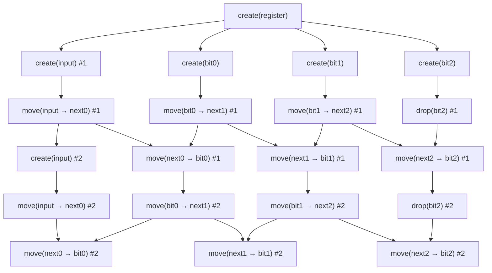

# Concurrent shift register in Define

A 3-cell shift register. `/register` represents the register itself. It is set
up by `action</construct>` which puts it into a valid initial state (it has 3
bits). It has an `action</shift>` that shifts each bit to the right and pushes
the rightmost bit off the register (destroys it).

`action</main>` shifts the bits twice. This results in a total action graph that
looks like:

Each step runs as soon as the steps it depends on are done. A step never waits
for anything else, so many steps happen at the same time.

When the register is created in `action</construct>`, its three cells get their
bits at the same time, and the first input bit is created right then too.

A cell can be moved into the scratch buffer as soon as it has its bit, so the
first shift's three moves, plus dropping the bit that falls off the end, all
happen together (right after each cell gets its bit).

Moving a bit back into a cell from the buffer waits only for the two steps that
give it what it needs. For example, writing the new value of cell 0 waits for
just two things: the move of the input and cell 0 into the buffer. It does not
wait for cells 1 or 2.

The second shift does not wait for the whole first shift to finish. Each cell
moves on by itself. The moment the first shift finishes writing a cell, the
second clock can start reading that same cell, even while the first clock is
still working on the other cells. And because the first clock uses up the input
bit early, the second input bit can be created right away, while the first clock
is still running.

So the two clocks overlap instead of running one fully after the other. The only
thing that sets the total time is the longest chain of steps that truly have to
happen in order, which is about six steps long (for example, following one cell
all the way through both clocks). There is no point where everything stops and
waits for everything else.
