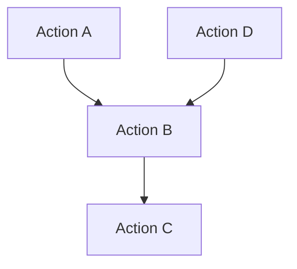
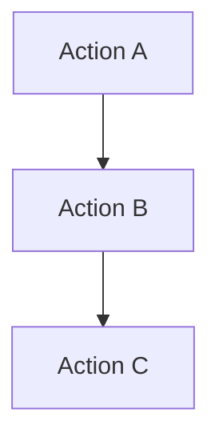

# Define Language Proposal 37: Automatic Position Presence Constraints

- **Author:** Max Kanat-Alexander
- **Status:** Draft
- **Date Proposed:** March 21, 2026
- **Date Finalized:**

## Problems

As described in [DLP 18 (Modular Constraints)](00018-modular-constraints.md),
the Define compiler must be able to analyze and prove the state of dimension
points within an action without having to first analyze the whole program (steps
3 and 4 of that proposal). Otherwise, proving correctness becomes an intractable
problem.

In particular, one of the key aspects that Define must be able to prove is the
presence or absence of dimension points in positions.

This gets us into a discussion of modular action analysis in general, as well as
pointing out some specific problems that we face in Define.

### 1: Self-Contained (Modular) Analysis of Actions

In order to have modular analysis, each action must be able to be verified in a
self-contained manner. To understand part of the problem, see this Java example:

```Java
public class BankAccount {
    private double balance;

    public BankAccount(double initialBalance) {
        this.balance = initialBalance;
    }

    public void withdraw(double amount) {
        this.balance -= amount;
    }
}
```

If a static analyzer looks only at the `withdraw` method in complete isolation,
it cannot determine if this code is correct or safe. What if `amount` is
negative? What if `amount` is larger than the balance? A static analyzer would
have to do whole-program dataflow analysis to actually prove safety for this
_very_ simple case.

Sure, the programmer could add checks to the `withdraw` method, but the
programming language doesn't _require_ them to, and thus modular analysis of
Java is not possible for all programs.

### 2: Cross-Action Verification

What if an action calls another action? How can we verify the caller's code
without having to look into the code of the callee? To understand this problem,
let's look at an example in Python:

```Python
def process_middle_element(data: list[int]) -> int:
    index = compute_safe_index(len(data))
    value = data[index]
    return value

def compute_safe_index(max_val: int) -> int:
    return max_val // 2
```

When we analyze `process_middle_element`, we need to know two things:

- Does `len(data)` produce a value that is acceptable to pass into
  `compute_safe_index`?
- Will `compute_safe_index` return an index that is always safely within the
  `data` array?

Sure, you and I can look at the code of `compute_safe_index` and see whether or
not that's the case (in fact, the code is broken for empty arrays) but that
fundamentally breaks modular analysis. Somehow, the _compiler_ has to know, when
analyzing `process_middle_element`, what the guarantees and requirements of
`compute_safe_index` are.

### 3: Obvious Preconditions

In order to accomplish modular analysis, many systems of program verification
require you to specify preconditions on functions that are already obvious in
the code. For example, take this imaginary example of a requirements syntax
inside of something like a C# syntax:

```C#
method GetElement(arr: array<int>, index: int) returns (val: int)
    requires arr != null;
    requires index >= 0 && index < arr.Length;
{
    return arr[index];
}
```

It is completely obvious that the array has to be non-null and that the index
has to be within the bounds of the array. Theoretically, it should not have been
necessary for a compiler to make me, the developer, actually write that. The
compiler should have been able to figure that out.

In our case, in Define, the fact that a statement requires a dimension point to
exist or not exist in a position is completely obvious. If you're putting a new
dimension point there, it has to be empty. If you're removing a dimension point,
it has to be present.

### 4: Duplicating the Code in the Postcondition

Many systems that solve for modular analysis require you to explicitly specify
"post-conditions" that say what state a variable must be in at the end of a
function. However, very often this forces the developer to duplicate something
that's totally obvious from the code itself. For example, take this example
using the Java Modeling Language (JML):

```Java
public class Counter {
    private int count;

    //@ ensures this.count == newCount;
    public void setCount(int newCount) {
        this.count = newCount;
    }
}
```

That postcondition is tedious, pointless duplication. It's necessary in JML, but
a language designed for verification can do better.

In particular, in Define, we should always (or nearly always) be able to tell
which dimension point is located where, at the end of an action.

### 5: The State of Quality-Required Positions and Actions

As described in [DLP 22 (Atomic Qualities)](00022-atomic-qualities.md),
positions and actions can require other positions and actions to exist on the
same dimension point.

This creates a subtle problem for modular analysis. In order to safely interact
with a required position, or with the interface positions of a required action,
the compiler also has to know whether those positions are occupied or empty.

The difficulty is that a required action may have already existed on the
dimension point before the current action was assigned. Other actions may have
already interacted with its interface positions. Thus, the current action cannot
simply assume that those interface positions are in some initial empty state.

For example, imagine this Define code:

```
define the potential action<mv:example.com:bank:/account/withdraw> {
    define the position<run>.
    define the position<amount>.

    it happens when {
        the position<run> has a dimension point.
    } and it does {
        destroy the dimension point in position<amount>.
        destroy the dimension point in position<run>.
    }
}

define the potential action<mv:example.com:bank:/account/charge_monthly_fee> {
    this dimension point must have the action</account/withdraw>.

    define the position<run>.

    it happens when {
        the position<run> has a dimension point.
    } and it does {
        create a dimension point in action</account/withdraw>::position<amount>.
        create a dimension point in action</account/withdraw>::position<run>.
        destroy the dimension point in position<run>.
    }
}
```

`charge_monthly_fee` requires `withdraw`, so it knows that
`action</account/withdraw>` exists on the same dimension point. However, that
does not tell us whether `action</account/withdraw>::position<amount>` is empty
at the moment when `charge_monthly_fee` tries to create a dimension point there.
Some other action may already have interacted with `withdraw`'s interface
positions earlier.

Thus, if Define is going to support modular analysis, actions must somehow carry
information not just about the positions they define directly, but also about
the occupied/empty state of any quality-required positions they depend on.

### 6: Unclear Error Messages from Verification Tools

Most verification tools, even very good ones like Dafny, often produce
frustratingly unclear error messages that developers have a hard time
interpreting.

For example, take this Dafny code:

```C#
class Account {
  var id: int
  var balance: int
}

method UpdateBalance(a: Account, newBalance: int)
  requires a != null
  modifies a // We tell Dafny this method modifies the account
  ensures a.balance == newBalance
{
  a.balance := newBalance;
}

method ProcessAccount(a: Account)
  requires a != null
  requires a.id > 0 // Precondition: ID must be valid
{
  // Do some processing...
}

method Main(a: Account)
  requires a != null
  requires a.id > 0     // We start with a valid ID
  requires a.balance == 0
{
  UpdateBalance(a, 100);

  ProcessAccount(a); // ERROR TRIGGERS HERE
}
```

When you run this through Dafny, you get an error on the `ProcessAccount(a);`
line inside `Main`:

```
example.dfy(28,16): Error: a precondition for this call could not be proved.
example.dfy(16,13): Related location: this is the precondition that could not be proved.
```

Basically you get an error at ProcessAccount because of some problem that was
actually triggered by UpdateBalance modifying `a`, but Dafny can't know the
source of the problem because it's using an SMT solver (Z3, in Dafny's case) to
check these requirements and the SMT solver doesn't know anything about the
actual code.

## Solution

In Define, the compiler can automatically determine:

1. **Action Position Requirements**: Which external dimension points an action
   requires to be occupied or empty.
2. **Action Position Guarantees**: Which dimension point is in any interface
   position or quality-required position that the action defines after the
   action completes.

That is simply stated. However, the details of this are fairly involved.

### Auto-Determining Requirements

The first time an Action Statements Block references one of its own interface
positions or one of its quality-required positions (including interface
positions on quality-required actions), that imposes a requirement on that
position. These requirements are treated as satisfied while compiling the action
itself, and are lifted into the action's definition automatically by the
compiler, to be used when analyzing requirements for other actions.

If the first reference is creating a dimension point in that position or moving
a dimension point to that position, the requirement is that the position must be
empty.

If the first reference is moving a dimension point from that position or
destroying a dimension point in that position, the requirement is that the
position must be occupied.

### Implicit Requirements on Chained Names

If an action accesses an inner member via a chained name, that implicitly
creates the requirement that all positions in that chain must have a dimension
point.

For example, imagine an action that has the interface position `position<foo>`
with the constraint `position</bar>` on it. When we look at this statement:

`create a dimension point in position<foo>::position</bar>::position</baz>`

If that were the first statement in the action, it would implicitly create
_three_ requirements:

- `position<foo>` must have a dimension point
- `position<foo>::position</bar>` must have a dimension point
- `position<foo>::position</bar>::position</baz>` must be empty

### Auto-Generating Guarantees

On completion of an action, the compiler can automatically determine not just
the action's guarantees for presence or absence of dimension points, but also
its guarantees about the _identity_ of dimension points.

For example, if dimension point A was passed in to interface position P,
operated on in some way, then moved to interface position R, we automatically
know that the dimension point in position R is dimension point A. This is
important because it means that the exact qualities on point A have been
preserved, even if position P had narrower quality requirements than the actual
set of qualities on dimension point A.

If an output dimension point is not identifiable as being an input dimension
point, then we know it came from somewhere else (such as a creation statement
inside of this action) and should be able to guarantee what its exact qualities
are.

For positions that get passed to another action's interface positions, or which
are moved into quality-required positions that are operated on by another
action, we use that other action's guarantees as part of the calculation for
determining these facts.

This means that action guarantees must be generated via a post-order depth-first
search on the reference graph (which global definitions reference each other) in
order to be complete.

### Guarantees Include External Positions

An action's auto-generated guarantees don't just include the identity and
occupancy for its interface positions, but also for any quality-required
positions it depends on, including the interface positions of quality-required
actions.

### Initial State of Interface Positions

When an action is first assigned to a position, its interface positions are
empty. Only after it is called do its guarantees apply.

An action's trigger positions are also automatically considered constraints on
positions that are treated as satisfied when compiling any individual action.

### Position Init Block Guarantees

In addition to generating guarantees on referenced quality-required positions,
Position Initialization Blocks also have one special guarantee they create that
other Action Statement Blocks cannot create: they create guarantees when they
affect dimension points in their self-referenced position or children of that
position.

Let's take an example where `position</a>` has an init block that creates a
dimenension point in itself. `position</a>` has the contract:
`it has the position</dep>`, and `position</dep>` also has an init block that
creates a dimension point in itself. So when I do:

```define
define the position<local> {
    it may only contain dimension points where {
        it has the position</a>.
    }
}
create a dimension point in position<local>.
```

Then I can _guarantee_ that `position<local>::position</a>` is filled, and also
that `position<local>::position</a>::position</dep>` is filled. Also, the
position init block of `position</a>` itself can guarantee that `position</dep>`
filled and could actually move or destroy that position, thus creating a
_different_ guarantee than what `position</dep>` normally provides.

### Requirements Follow Dimension Points

Above I described how _positions_ are affected, but the reality is that
requirements follow dimension points, not actually positions. If I move a
dimension point from an interface position into a local position and then do
something with one of the children of that dimension point, it still creates a
requireemnt in the caller. This is true for all forms of requirements.

So if I have `position<interface_pos>` and I move the dimension point of that
into `position<some_local>` and then do
`create a dimension point in position<some_local>::position</should_be_filled>`,
that creates a requirement for the caller to fill
`position<interface_pos>::position</should_be_filled>`.

### Error States from External Interactions

This system means that actions assume that callers have satisfied their implicit
contracts before calling them.

Only an action's _caller_ experiences error states from another action's
requirements. The caller also experiences error states from taking actions that
are not valid under the callee's guarantees.

For example, let's say we have the following situation:

1. Action A has a local position L that requires qualities Q, R, and S.
2. Action A creates a dimension point (which we will call D) in local position
   L.
3. Action A wants to call Action B.
4. Action A moves dimension point D into Action B's trigger position T, which
   only requires quality Q.
5. At this point, if Action B required some other dimension point to be filled
   before running, the compiler would register an error in Action A.
6. If everything is okay, Action B runs.
7. Action A attempts to move the dimension point in position T back into
   position L.
8. If it's the same dimension point, this works! If it's a new dimension point,
   the guarantees provided by Action B dictate whether or not that move is
   allowed.

### Internal Error States

Actions can still mess up moves, creations, and destructions internally, so they
can still experience errors in their own code. They just can't experience errors
about their own auto-generated requirements, since they assume those to be true.

### Upward Chaining of Guarantees for Quality-Required Positions

When an action creates a guarantee about a quality-required position or action,
that guarantee must be carried transitively up the call chain until something
higher in the call chain makes a different guarantee about that position.

In other words, let's say you have a call chain like A -> B -> C. C creates a
dimension point in `position</slot>` in its code. This guarantee is provided to
B, and B also provides that guarantee to A.

That said, any other limitations on external guarantees still apply. At some
point in the call chain, `position</slot>` is something that was assigned to a
local position, and we don't expose guarantees about local positions, so the
upward chaining would stop at that point.

To be clear, only guarantees about quality-required positions and actions chain
upward in this way. Guarantees about local positions and all chained names
attached to them remain internal implementation details of the action that
defines them. Guarantees about this action's interface positions are only
provided to its direct caller. It is only when quality-requirement syntax comes
into play that we have to do explicit transitive chaining.

### Upward Chaining of Requirements for Quality-Required Positions

Requirements on quality-required positions also chain upward transitively, but
only when the caller action has not already satisfied those requirements itself
before interacting with the callee.

To illustrate this, imagine you have a call tree like this:



If B does not satisfy some requirement of C, then both A and D have to satisfy
that requirement. But if B satisfies all requirements of C, then A and D know
nothing about C's requirements.

This can create confusing error states when a programmer makes a mistake, so the
compiler should try extra hard to provide very clear errors here with the full
chain of the requirement that was violated and exact code locations where it's
being checked in every action in the chain, to be as helpful as possible when
such requirements are not fulfilled.

### Upward Chaining of Empty Requirements on Interface Positions

Unlike with guarantees, requirements on interface positions _do_ chain upward
transitively on the call chain. For example, imagine you have a call tree like
this:



Action C has an interface position named `position<c_iface>` with a child
position like `position<c_iface>::position</should_be_empty>`. In its body, it
does
`create a dimension point in position<c_iface>::position</should_be_empty>`.
Action B doesn't fill this, correctly. However, Action A does fill it. That's an
error! So Action A has to know that Action C creates a transitive requirement
thorugh Action B.

Now imagine that instead, Action C had
`position<c_iface>::position</should_be_filled>` and was doing
`destroy the dimension point in position<c_iface>::position</should_be_filled>`.
In that case, either Action A _or_ Action B must fill
`position</should_be_filled>`. Honestly, it is probably bad software design to
force Action A to fill an interface position in a deeply-nested action, but if
we _didn't_ propagate requiements like this, it would be logically inconsistent
with how we propagate empty requirements (which is necessary for correctness).
Also, perhaps there is some valid reason for this pattern (though I am
skeptical).

## A Real Program

### Valid Direct Requirements and Guarantees

This example shows a valid call where one action's direct requirements are
satisfied and its direct guarantee is used afterward.

```
define the potential position<mv:example.com:example:/slot>.

define the potential action<mv:example.com:example:/store_in_slot> {
    this dimension point must have the position</slot>.

    define the position<run>.
    define the position<item>.

    it happens when {
        # Only the trigger position is explicit here.
        the position<run> has a dimension point.
    } and it does {
        # This first reference means position<item> must already be occupied.
        # It also means position</slot> must be empty.
        move the dimension point in position<item> to position</slot>.
        destroy the dimension point in position<run>.
    }
}

define the potential action<mv:example.com:example:/valid_direct_example> {
    define the position<run>.

    it happens when {
        the position<run> has a dimension point.
    } and it does {
        define the position<drawer> {
            it may only contain dimension points where {
                it has the position</slot>.
                it has the action</store_in_slot>.
            }
        }
        define the position<spare_item>.

        create a dimension point in position<spare_item>.
        create a dimension point in position<drawer>.

        # This satisfies store_in_slot's implicit requirement that item be
        # occupied before the action runs.
        move the dimension point in position<spare_item> to position<drawer>::action</store_in_slot>::position<item>.
        create a dimension point in position<drawer>::action</store_in_slot>::position<run>.

        wait until {
            NOT position<drawer>::action</store_in_slot>::position<run> has a dimension point.
        }

        # This is valid because the action guarantees that the same dimension
        # point now exists in position</slot>.
        move the dimension point in position<drawer>::position</slot> to position<spare_item>.
    }
}
```

### Invalid Direct Requirements

This example shows direct requirements being violated in two different ways on
the same shared external position.

```
define the potential position<mv:example.com:example:/slot>.

define the potential action<mv:example.com:example:/store_in_slot> {
    this dimension point must have the position</slot>.

    define the position<run>.
    define the position<item>.

    it happens when {
        the position<run> has a dimension point.
    } and it does {
        move the dimension point in position<item> to position</slot>.
        destroy the dimension point in position<run>.
    }
}

define the potential action<mv:example.com:example:/clear_slot> {
    this dimension point must have the position</slot>.

    define the position<run>.

    it happens when {
        the position<run> has a dimension point.
    } and it does {
        # This first reference means position</slot> must already be occupied.
        destroy the dimension point in position</slot>.
        destroy the dimension point in position<run>.
    }
}

define the potential action<mv:example.com:example:/invalid_direct_example> {
    define the position<run>.

    it happens when {
        the position<run> has a dimension point.
    } and it does {
        define the position<drawer> {
            it may only contain dimension points where {
                it has the position</slot>.
                it has the action</store_in_slot>.
                it has the action</clear_slot>.
            }
        }
        define the position<spare_item>.

        create a dimension point in position<drawer>.
        create a dimension point in position<drawer>::position</slot>.
        create a dimension point in position<spare_item>.

        # Compiler error: store_in_slot requires position</slot> to be empty,
        # but this code has already occupied it.
        move the dimension point in position<spare_item> to position<drawer>::action</store_in_slot>::position<item>.
        create a dimension point in position<drawer>::action</store_in_slot>::position<run>.

        # Compiler error: clear_slot requires position</slot> to be occupied
        # before it runs, but nothing in this branch re-establishes that fact
        # after store_in_slot finishes.
        create a dimension point in position<drawer>::action</clear_slot>::position<run>.
    }
}
```

### Chained Name Requirements

This example shows how a chained name requires every intermediate position in
the chain to already contain a dimension point.

```
define the potential position<mv:example.com:example:/tag>.

define the potential position<mv:example.com:example:/selected_item> {
    it may only contain dimension points where {
        it has the position</tag>.
    }
}

define the potential action<mv:example.com:example:/tag_selected_item> {
    this dimension point must have the position</selected_item>.

    define the position<run>.

    it happens when {
        the position<run> has a dimension point.
    } and it does {
        # This chained reference means:
        # 1. position</selected_item> must already contain a dimension point.
        # 2. position</selected_item>::position</tag> must be empty.
        create a dimension point in position</selected_item>::position</tag>.
        destroy the dimension point in position<run>.
    }
}

define the potential action<mv:example.com:example:/chained_name_examples> {
    define the position<run>.

    it happens when {
        the position<run> has a dimension point.
    } and it does {
        define the position<valid_box> {
            it may only contain dimension points where {
                it has the position</selected_item>.
                it has the action</tag_selected_item>.
            }
        }
        define the position<invalid_box> {
            it may only contain dimension points where {
                it has the position</selected_item>.
                it has the action</tag_selected_item>.
            }
        }

        create a dimension point in position<valid_box>.
        create a dimension point in position<valid_box>::position</selected_item>.
        # Valid: every intermediate position in the chain is occupied.
        create a dimension point in position<valid_box>::action</tag_selected_item>::position<run>.

        create a dimension point in position<invalid_box>.
        # Compiler error: invalid_box::position</selected_item> is still empty,
        # so the chained requirement is not satisfied here.
        create a dimension point in position<invalid_box>::action</tag_selected_item>::position<run>.
    }
}
```

### Transitive Guarantee Chaining

This example shows a transitive guarantee causing a compiler error when a
higher-level action assumes the opposite state after a nested call chain.

```
define the potential position<mv:example.com:example:/slot>.

define the potential action<mv:example.com:example:/clear_slot> {
    this dimension point must have the position</slot>.

    define the position<run>.

    it happens when {
        the position<run> has a dimension point.
    } and it does {
        destroy the dimension point in position</slot>.
        destroy the dimension point in position<run>.
    }
}

define the potential action<mv:example.com:example:/prepare_slot> {
    this dimension point must have the position</slot>.
    this dimension point must have the action</clear_slot>.

    define the position<run>.

    it happens when {
        the position<run> has a dimension point.
    } and it does {
        # prepare_slot satisfies clear_slot's requirement internally.
        create a dimension point in position</slot>.
        create a dimension point in action</clear_slot>::position<run>.

        wait until {
            NOT action</clear_slot>::position<run> has a dimension point.
        }

        # clear_slot guaranteed that position</slot> is empty again.
        destroy the dimension point in position<run>.
    }
}

define the potential action<mv:example.com:example:/invalid_after_prepare> {
    this dimension point must have the position</slot>.
    this dimension point must have the action</prepare_slot>.

    define the position<run>.

    it happens when {
        the position<run> has a dimension point.
    } and it does {
        create a dimension point in action</prepare_slot>::position<run>.

        wait until {
            NOT action</prepare_slot>::position<run> has a dimension point.
        }

        # Compiler error: prepare_slot guarantees that position</slot> is empty
        # when it finishes. That fact originated in clear_slot, but it chains
        # upward through prepare_slot and is still known here.
        #
        # Because of that transitive guarantee, trying to destroy the dimension
        # point in position</slot> is invalid.
        destroy the dimension point in position</slot>.
        destroy the dimension point in position<run>.
    }
}
```

### Transitive Requirement Chaining

This example shows an external requirement propagating upward until a higher-
level caller fails to satisfy it.

```
define the potential position<mv:example.com:example:/slot>.

define the potential action<mv:example.com:example:/clear_slot> {
    this dimension point must have the position</slot>.

    define the position<run>.

    it happens when {
        the position<run> has a dimension point.
    } and it does {
        # This means clear_slot requires position</slot> to already be occupied.
        destroy the dimension point in position</slot>.
        destroy the dimension point in position<run>.
    }
}

define the potential action<mv:example.com:example:/request_slot_clear> {
    this dimension point must have the position</slot>.
    this dimension point must have the action</clear_slot>.

    define the position<run>.

    it happens when {
        the position<run> has a dimension point.
    } and it does {
        # request_slot_clear does not satisfy clear_slot's requirement itself.
        # That means the requirement on position</slot> chains upward.
        create a dimension point in action</clear_slot>::position<run>.

        wait until {
            NOT action</clear_slot>::position<run> has a dimension point.
        }

        destroy the dimension point in position<run>.
    }
}

define the potential action<mv:example.com:example:/transitive_requirement_examples> {
    define the position<run>.

    it happens when {
        the position<run> has a dimension point.
    } and it does {
        define the position<box> {
            it may only contain dimension points where {
                it has the position</slot>.
                it has the action</request_slot_clear>.
            }
        }

        create a dimension point in position<box>.
        # Compiler error: request_slot_clear exports clear_slot's requirement
        # that position</slot> already be occupied, and box does not
        # satisfy that requirement before the call.
        create a dimension point in position<box>::action</request_slot_clear>::position<run>.
    }
}
```

### Local Actions Do Not Export Their Internal Requirements

This example shows that requirements on actions assigned to local positions stay
inside the current action instead of chaining upward to its callers.

```
define the potential position<mv:example.com:example:/slot>.

define the potential action<mv:example.com:example:/clear_slot> {
    this dimension point must have the position</slot>.

    define the position<run>.

    it happens when {
        the position<run> has a dimension point.
    } and it does {
        destroy the dimension point in position</slot>.
        destroy the dimension point in position<run>.
    }
}

define the potential action<mv:example.com:example:/local_action_example> {
    define the position<run>.

    it happens when {
        the position<run> has a dimension point.
    } and it does {
        define the position<local_box> {
            it may only contain dimension points where {
                it has the position</slot>.
                it has the action</clear_slot>.
            }
        }

        create a dimension point in position<local_box>.

        # Compiler error inside local_action_example: clear_slot requires
        # position<local_box>::position</slot> to already be occupied.
        #
        # This requirement does not chain upward to callers of
        # local_action_example, because local_box is local state.
        create a dimension point in position<local_box>::action</clear_slot>::position<run>.
    }
}
```

## Why This is the Right Solution

This solution:

- Eliminates developer toil.
- Removes unnecessary code from Define programs.
- Removes the potential for human error in typing requirements and/or guarantees
  that can be trivially deduced from code.
- Produces clear error messages because it has done full static analysis of the
  code.
- Makes it so that programmers don't have to reason through obvious
  preconditions and they instead just get them for free by writing Define
  syntax.

I actually had originally written up a plan that involved developers explicitly
having to specify requirements for position occupancy, and then we lifted those
requirement statements up to be preconditions, plus determined guarantees
similar to how this proposal does it. In fact, that proposal is in the version
control history of this proposal. However, halfway through I realized that I was
forcing developers to write completely redundant statements and that we should
simply figure it all out ourselves, instead.

## Forward Compatibility

This proposal does not add new syntax. It specifies compiler behavior that is
derived from syntax that already exists, which makes it straightforward to
extend in the future as Define gains more kinds of action statements and
position references.

If we ever somehow _did_ need to put these as requirement/guarantee statements
explicitly into code, we could easily do so because we can determine them all
statically.

## Refactoring Existing Systems

This should make it easier to translate programs from systems that require
manual preconditions and postconditions, because many of the obvious position
presence facts can simply be omitted and inferred by the Define compiler.

Also, this is a nice benefit of translating programs into Define, which is that
you will get these presence checks for free.
