# Define Language Proposal 44: Deterministic Automatic Concurrency

- **Author:** Max Kanat-Alexander
- **Status:** Draft
- **Date Proposed:** July 2, 2026
- **Date Finalized:**

<!-- TODO: A lot of the examples in this proposal actually probably need to be fixed to not show dependencies on the trigger position, and to explain how the rule is more like "we see a requirement and then a trigger" or something like that. -->

## Problems

Programs need some way to indicate that multiple things can happen at the same
time. Not only is this useful for actual computers (which can do many tasks in
parallel) it's the reality of real universes: many activities happen
simultaneously. It's not like there's some timer that's ticking forward and only
one action in the whole universe happens in any given tick. Even if a universe
_has_ such a "time tick" (which Define strives to avoid, on the basis that time
introduces complexity) there can still be multiple actions that happen within
the same tick.

(You can actually reason through this for the physical universe, by the way, by
determining how many actions must be occurring, the likely number of particles
in the physical universe, and the smallest unit of time that can possibly
exist---the "Planck time"---and realizing that concurrent actions _must_ be
happening or the physical universe couldn't be functioning as it does.)

There are many different aspects to this problem and a lot of background to
understand about different methods of concurrency.

### Background: Traditional Languages

#### Reasoning About Concurrency

Reasoning about two or more actions happening simultaneously is traditionally
one of the hardest parts of computer programming. It's very difficult for a
programmer to reason through how many different parallel actions can be written
safely, without races, deadlocks, or other concurrency issues. Even very
experienced programmers struggle to reason through this and may not be familiar
with the best concurrency patterns for every situation.

#### Primitive Concurrency

Most languages solve the difficulty of concurrency by, essentially, not solving
it all and leaving it entirely up to the programmer. They provide primitives for
creating threads, and primitives for locks so that the programmer can decide how
to prevent threading issues.

What ends up being strange about this is that the correct patterns for threading
and locking end up being very few. You end up with patterns like:

- The **double check-idiom**: check a field, then take a lock and check the
  field again inside the lock to make sure it wasn't changed since you last
  checked it.
- **Duplicate Data**: One way or another, each thread gets its own copy of
  something, so that it doesn't have to lock a shared copy.
- **Channels / Actors**: Various patterns that look like: any thread can put
  actions into a queue and then other threads can execute those actions by
  draining the queue. The only thing that needs locking is the queue, provided
  all the required data for the thread is in the queue. Exactly what type of
  locking depends on how many threads can put things into the queue and how many
  threads execute the items from the queue (one or many, for both sides).
- **Semaphore Count**: You spawn a bunch of threads. You know how many threads
  you spawned. When each thread is done they decrement a shared counter, and
  when that counter gets to zero you can continue with the program. The only
  thing that needs a lock is the counter, provided the threads don't share data.

There are a few more patterns than that, but actually not too many. Not
following one of these patterns is essentially always an error, in languages
that provide those primitives. In the situations where you need to do something
else, often what you're really doing is systems-level programming where you care
about the _real_ concurrency primitives the CPU provides and you actually want
_those_ instead of these intermediate primitives the language provides.

And yet, the languages that provide these primitives are perfectly happy to
allow you to do the wrong thing, because there's no way for the compiler to know
whether the intention you're expressing is actually safe.

#### Failing to Parallelize

Because concurrency is so hard to reason about, there are many actions in a
program that _could_ be done safely in parallel, but the programmer does them in
order because that's _so_ much easier to reason about. I myself would tell any
programmer in a traditional language to avoid concurrency unless they actually
really need it.

#### Proving Concurrency

If you think it's hard for a human to reason about concurrency, it can be even
harder for formal verification systems to do so. There are actually very few
formal verification systems that can verify concurrent code, because they rely
on forms of logic that don't account for parallel actions. Most of them require
some form of "hack" to make concurrent verification work, to the point that any
developers attempting to prove their programs fall back to either (a) only
writing synchronous code or (b) only proving the synchronous _parts_ of their
system and then having a separate mechanism that they _hope_ produces thread
safety.

### Advanced Concurrency Systems

Some languages have taken unique approaches to concurrency that are worth
mentioning here as a background

#### Positions Become "Lattices"

In a language called `Bloom^L` and in the concept of CRDTs (Conflict-free
Replicated Data Types) variables are not individual points in space, but instead
they are "lattices." Essentially, a lattice is the result of running a bunch of
"merge" operations on instructions the lattice received over time. One machine
says `position<x> is green` and another says `position<x> is blue` and those get
merged and it has both colors. When there are conflicts, the system knows the
order in which it received the conflicting instructions and it resolves them in
that order (with instructions for what to do if the lattice's value becomes
"deleted" before other things try to change it). When there are real conflicts
that happen at the same instant, the program has an arbitrary mechanism for
determining which goes first. In general, a lattice has some strategy for
merging different operations that it executes.

This all sounds nice until you realize that it doesn't actually resolve
concurrency in a system that runs in zero time like Define. In `Bloom^L` what
happens with true conflicts is that the value of the position becomes an
error---in other words, any part of the program that attempts to access that
position afterward throws an error and crashes the program.

Bloom does have an interesting approach to dealing with the other aspects of
parallelism, however. Bloom programs are sets of unordered logic rules. To make
them run, the compiler analyzes the dependencies:

1. **Monotonic Logic (Safe)**: Rules that just add information (e.g., "If ball
   is at A, mark A as occupied"). These can run in any order, or simultaneously,
   and the result is always the same.
2. **Non-Monotonic Logic (Unsafe)**: Rules that depend on the absence of
   something or change a value (e.g., "If ball is NOT at B...").

The compiler then breaks the program into Strata (layers):

- **Stratum 1**: Run all the safe, additive logic until it settles (reaches a
  fixed point).
- **Stratum 2**: Now that we are sure about what is true in Stratum 1, we can
  run the "unsafe" logic that depends on it.

In Define we would have to do those steps over and over as the compiler moves
through a program, as later safe code could depend on the behavior of earlier
unsafe code. Bloom solves that problem by introducing the concept of sequence,
where the programmer must explicitly indicate that some code happens after other
code, but only when there are logical conflicts that _require_ you to make that
decision. This re-introduces the programmer to having to reason through
concurrency, introduces time into a program, and it means that a change in one
part of the program can now require a programmer to go modify some very distant
other part of it (and the current programmer possibly doesn't own that other
part of the program).

#### Optimistic Concurrency (Software Transactional Memory)

Languages like Haskell do something called Optimistic Concurrency with Software
Transactional Memory. It works by treating actions like database transactions.
Here's how it does that:

1.  **The Recording Phase**: When an action (transaction) starts, it creates a
    private log.
    - Every time it reads a variable (like a ball in `position</my_ball>`), it
      records the version it saw.
    - Every time it writes to a variable, it writes to the private log, not the
      real universe.

2.  **The Validation Phase (Commit)**: When the action finishes, the STM runtime
    pauses for a microsecond to check the "Real Universe."
    - It asks: "Has any variable I read changed since I started?"

3.  **The Resolution**:
    - **Success**: If nothing changed, the private log is flushed to the real
      universe instantaneously.

    - **Conflict**: If `action</move_left>` finished 1 nanosecond ago and moved
      a ball into `position</left>`, then the parallel `action</move_right>`
      transaction realizes its snapshot is stale. It automatically abandons
      everything.

4.  **Retries**: When a transaction fails, the runtime automatically restarts
    it.

This is super cool, but it doesn't solve our problems for Define, because it
means that when we statically analyze the program, we can't know whether
`position</my_ball>` will be in `position</left>` or `position</right>`, which
breaks all of our guarantees and safety. It also requires an explicit "Define
runtime" to exist, which we are trying to avoid as much as possible for
fully-optimized, compiled Define programs.

#### Join Calculus (Chords)

There is a type of logic used in some languages called "Join Calculus" to solve
the problem of conflicting actions on a single piece of data. In Join Calculus,
you define a "Chord"---a pattern of messages that must all be present before the
code runs. For example:

```csharp
// Standard handlers
when (move_left()) { ... }
when (move_right()) { ... }

// A Chord: This code ONLY runs if we receive 'move_left' AND 'move_right' at the same time.
when (move_left() & move_right()) {
   explode_ball();
}
```

In essence, you define what to do with the _specific conflict_, rather that
defining the ordering of actions, locks, etc. This does require the programmer
to predict all conflicts, but if they encounter a conflict, it allows them to
say "here's what should happen in that situation."

The problem is: what if the conflict is in some part of the system far away from
the part that you maintain? It can be very hard to reason through how to resolve
conflicts with something you don't understand. Also, what if you're maintaining
a library, and you are introducing potential conflicts into the code of your
users without you knowing it? How do you decide what to do about those
conflicts?

### Problems in Define

Within the language as we have it, there are certain specific problems we need
to solve about concurrency.

### Concurrency Within An Action

Within an action, does every single listed operation have to happen in the order
written? Is there a way to make multiple things happen in parallel within an
action? Should this happen via an explicit instruction by the programmer, or can
the compiler figure it out somehow?

### Concurrency of Action Triggers

When one action triggers another, does the calling action wait for the callee to
finish completely before continuing?

### Triggers on Shared Positions

What if my action has a Trigger Condition that looks like this:

`the position</shared> has a particle`

What if more than one action has that same Trigger Condition? What order do they
execute in? How do I resolve them executing in parallel? What happens if those
actions then modify _other_ shared positions, what order does all of that happen
in, especially if they both modify the _same_ shared position?

This leads to so much complexity that I spent several days researching and
working on a proposal to fix it, which can be seen in the version control
history of [DLP 26 (Action Triggering Order)](00026-action-triggering-order.md).

### Resolving Paradoxes

If we had some sort of explicit concurrency model, what would happen when two
parallel "threads" tried to take action on the same position at the same time?
How do we prove safety and have total static analysis of that situation?

## Solution

Define solves these problems by automatically determining what code is safe to
run concurrently, via a form of modular graph dataflow analysis, described
below.

Also, for now we **forbid triggering actions on implied positions**, in order to
simplify reasoning about concurrency and parallelism. We may change this in the
future, or we may not (as allowing it also adds significant complexity to the
compiler).

To be clear, everything within this proposal covers only operations on particles
themselves (create, move, and destroy statements), not the operations on values.
Those will be handled in a later proposal.

### Dataflow Analysis Within an Action

An action's actual work is done through a series of create, move and destroy
statements. As long as those statements do not depend on each other, the
compiler can choose to run them in parallel.

It does this by tracing a graph, for each _position_, of operations taken on
that position, and how those operations depend on each other. Any action on a
position becomes a node in this graph, and each node creates an edge to the
previous position that particle was in before that operation. The compiler can
then take "topological generations" of this graph and run them in parallel.

#### Examples of Dataflow Inside an Action

The simplest example is:

```define
create a particle in position<one>.
destroy the particle in position<one>.
```

If we call the first line "Create" and the second line "Destroy", we get a very
simple graph:

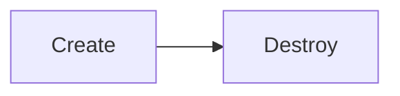

Here's a slightly more complex, but still straightforward, example:

```define
create a particle in position<one>.
move the particle in position<one> to position<two>.
destroy the particle in position<two>.
```

This starts to expose that our requirements are about _positions_.

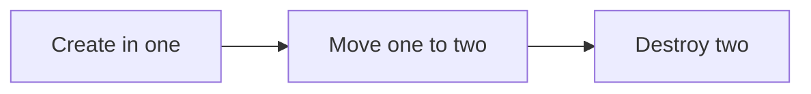

And this makes it even clearer:

```define
create a particle in position<one>.
destroy the particle in position<one>.
create a particle in position<two>.
destroy the particle in position<two>.
```

Now we see concurrency:

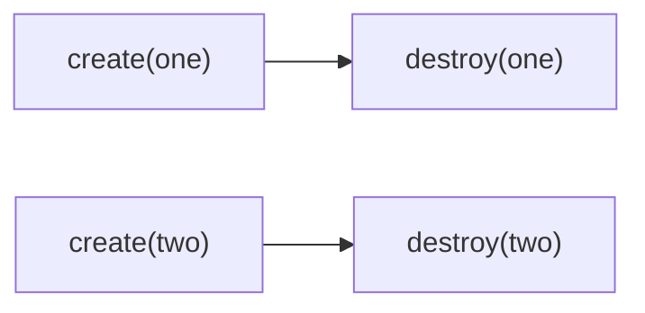

If we draw a directed acyclic graph that shows the _dependency_ that positions
have on each other, we can see what needs to be run serially (anything that has
a dependency relationship) and what can be run in parallel (anything with
independent roots).

This does have a few complexities to it, such as graphs that join:

```define
create a particle in position<one>.
destroy the particle in position<one>.
create a particle in position<two>.
move the particle in position<two> to position<one>.
```

That creates the following dependency graph:

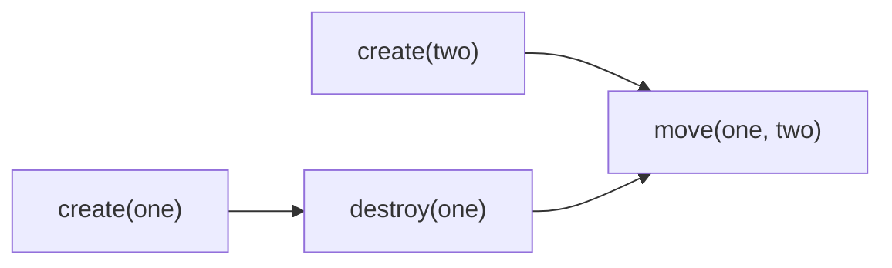

Everything before to the `move the particle` line can be run in parallel. Then
we have to wait for those operations to finish, and then we can do the move. But
you could also branch out again:

```define
create a particle in position<one>.
destroy the particle in position<one>.
create a particle in position<two>.
move the particle in position<two> to position<one>.

create a particle in position<two>.
destroy the particle in position<two>.

destroy the particle in position<one>.
```

Which becomes this graph:

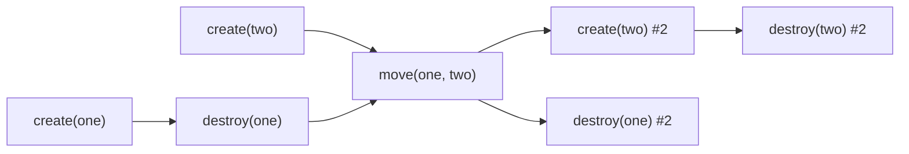

So we see the `move` statement is a barrier, but then we parallelize again.

### Concurrency Between Actions

What happens when one action triggers another is slightly more complex.
Currently, an action's guarantees are defined as though they occur
instantaneously upon triggering of the action (that is, all actions take no
time, logically, just like every other operation in Define). We don't change
those _contractual guarantees_, from a logical perspective, but we do change how
the compiler actually generates code from an action.

In essence, Define treats a guarantee on a position just like any other
operation in the dependency graph of position operations. What this means is
that anything that depends on a particle in an action's contracted positions
executes the instant that the callee performs its final operation on that
position. This means that actions are **not actually atomic units of
execution**, but the way we verify automated guarantees mean programmers should
never have to think about that (except when they are attempting to maximize
concurrency).

Logically, think of an action as a black box with several indicator lights on
the outside, and a person who is waiting for each indicator light to turn on.
Light 1 turns on, Person 1 starts their work. Light 2 turns on, Person 2 starts
their work, and so on. Each contracted position on an action is one of these
"indicator lights."

Since we forbid dead interface positions and dead implications (per
[DLP 32 (Dead Code Is Forbidden)](00042-dead-code-is-forbidden.md)), every
contracted position is operated on. The _last_ operation on a contracted
position "signals" to the caller that it can now perform further operations on
that position.

#### Lock-Free Code Generation Through Action Splitting

Our analogy of indicator lights and workers waiting on them sounds a bit like a
semaphore in traditional concurrency models. However, it is not my intention for
the _optimized_ output of Define's compiler to actually depend on such
constructs. Instead, during code generation, the compiler "splits" actions into
individual functions that return when the individual contracted positions are
complete. It does not duplicate data or spin up more threads that are called for
by this proposal, but rather chains together multiple different function calls
based on the input requirements and output guarantees of a function. It does
this modularly---an action has only one "split" representation.

Of course, the compiler may _choose_ to optimize beyond this or to inline action
code entirely where it makes sense. But the basic splitting behavior is
logically necessary to the correctness of the system without depending on
semaphores and so needs to be noted here in the proposal.

#### A Basic Dependency Graph with An Action

For the purposes of illustration, we start with the simplest actions: those that
exactly duplicate an existing operation. In these examples:

- `action</delete>` takes a single particle in its trigger
  `action</delete>::position<input>` and destroys that particle.
- `action</create>` has `position<run>` as its trigger position and creates a
  particle in `action</create>::position<output>`.
- `action</move>` has a trigger position called `action</move>::position<input>`
  and it moves that particle to `action</move>::position<output>`.

Some of the simplest code we could write to demonstrate this would be:

```define
create a particle in position<one>.
move the particle in position<one> to action</delete>::position<input>.
create a particle in action</delete>::position<input>.

create a particle in action</create>::position<run>.
destroy the particle in action</create>::position<output>.

create a particle in position<two>.
move the particle in position<two> to action</move>::position<input>.
destroy the particle in action</move>::position<output>.
```

Which would result in a very straightforward graph:

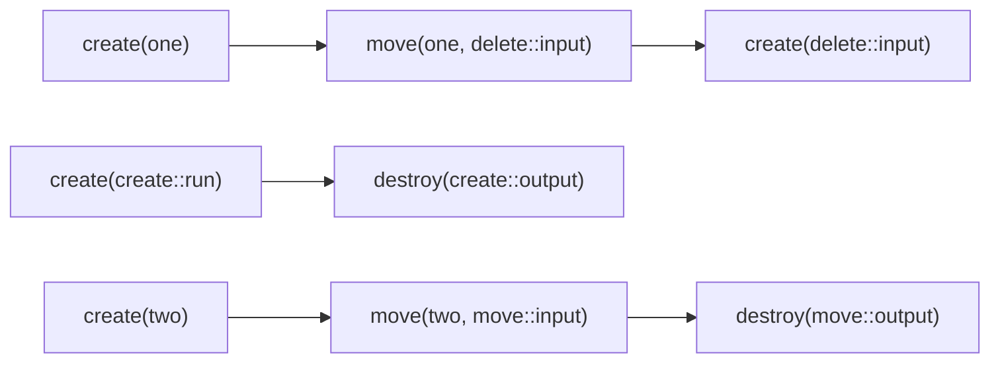

Three independent, concurrent chains.

#### Multiple Contracted Positions

This gets more interesting when you have more than one contracted position on an
action. For example, let's take the simplest case:

```define
define the potential action<example.com:example:/double_create> {
    define the position<first>.
    define the position<second>.
    define the position<run>.

    it happens when {
        the position<run> has a particle.
    } and it does {
        create a particle in position<first>.
        create a particle in position<second>.
    }
}
```

And imagine a caller with code like this:

```define
  create a particle in action</double_create>::position<run>.
  destroy the particle in action</double_create>::position<first>.
  destroy the particle in action</double_create>::position<second>.
```

The actual concurrency graph of that code looks like:

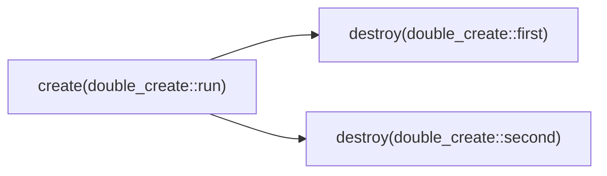

We can run both of those destroys in parallel. We don't have to wait for the
whole action to complete before we can destroy the particle in
`position<first>`. That's because what's really happening under the hood is just
this:

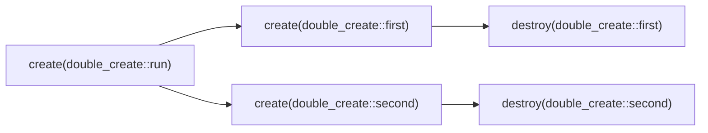

This demonstrates Action Splitting: the compiler has split `double_create`
internally into two separate, anonymous actions. Every single time
`double_create` is triggered, it will behave this way.

#### Double Move

Here's another interesting but simple example:

```define
define the potential action<example.com:example:/double_move> {
    define the position<first_in>.
    define the position<second_in>.
    define the position<first_out>.
    define the position<second_out>.
    define the position<run>.

    it happens when {
        the position<run> has a particle.
    } and it does {
        move the particle in position<first_in> to position<first_out>.
        move the particle in position<second_in> to position<second_out>.
    }
}
```

And then imagine a very simple caller:

```define
create a particle in action</double_move>::position<first_in>.
create a particle in action</double_move>::position<second_in>.
create a particle in action</double_move>::position<run>.
destroy the particle in action</double_move>::position<first_out>.
destroy the particle in action</double_move>::position<second_out>.
```

If you just look at the caller, it looks like this is what's happening:

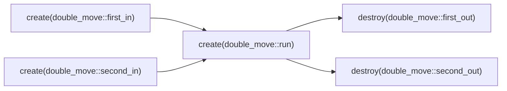

That looks like everything converges and waits for `position<run>` and then the
later steps trigger. But let's add in the real steps from inside of the action:

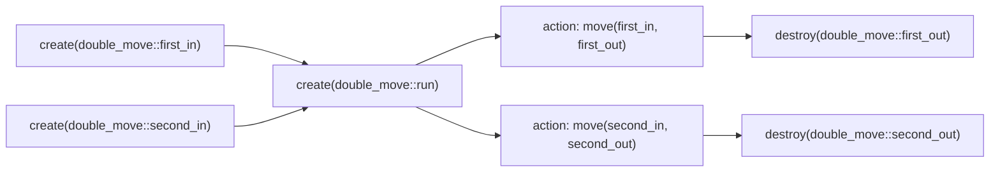

There's something suspicious about this graph: why do we even block on
`position<run>` at all? There is in fact, no logical need to do so. The graph
could just be:

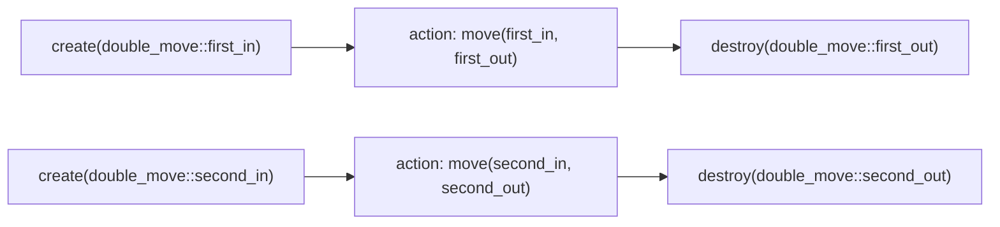

This is a very straightforward optimization. In fact, possibly the compiler
should even tell the developer that they must eliminate `position<run>` from the
code and make either `position<first>` or `position<second>` the trigger
position. (Or even tell them that they have a single action that should be
split.)

There are limits to that optimization---if `position<run>` had a constructor on
it, or later statements genuinely ever depended on `position<run>`, it would be
hard to eliminate. But it at least shows us one of our first glimpses of not
just deterministic concurrency, but _optimized_ deterministic concurrency.

#### More Complex Internal Logical Dependencies

In the above two examples, there were two logically independent sets of
statements running inside of the actions. What if there are more complex logical
dependencies inside of the action? Let's look at an example like that:

```define
define the potential action<example.com:example:/complex_create> {
    define the position<first>.
    define the position<second>.
    define the position<run>.

    it happens when {
        the position<run> has a particle.
    } and it does {
        create a particle in position<first>. # action line 1
        move the particle in position<first> to position<second>. # action line 2
        create a particle in position<first>. # action line 3
        destroy the particle in position<first>. # action line 4
        create a particle in position<first>. # action line 5
    }
}
```

First let's just consider the concurrency graph of _that_ action:

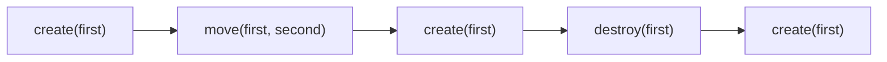

Looks entirely like a single, serial chain of events. However, action line 2 is
the last line that actually touches `position<second>`. So let's imagine you
have the same caller that we had above:

```define
create a particle in action</complex_create>::position<run>.
destroy the particle in action</complex_create>::position<first>.
destroy the particle in action</complex_create>::position<second>.
```

What is _actually_ happening with that caller, if we look inside the action?
Well, it actually looks like this:

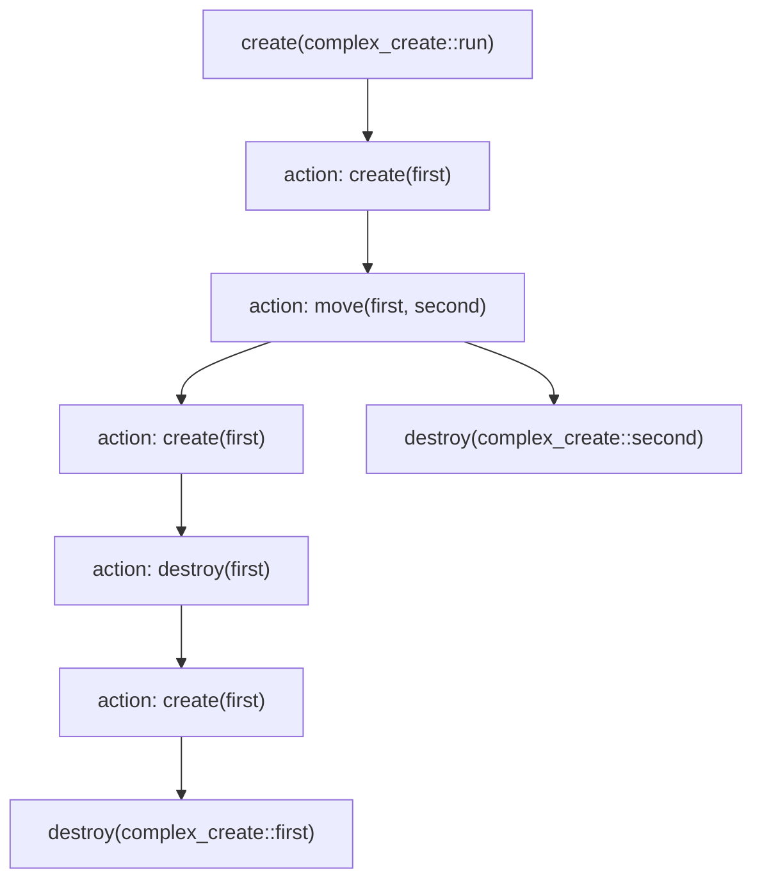

You can see that our destroy of `position<second>` happens long before our
destroy of `position<first>`. The way this works in the compiler is that it
splits `action</complex_create>` at action line 2.

### Fan-In and Joins

Every graph with actions above fanned _out_. Let's now look at an example where
a single caller operation depends on multiple actions that are executing
concurrently. This will use the same same `action</delete>` and
`action</create>` from our simplest examples.

```define
create a particle in position<one>.
move the particle in position<one> to action</delete>::position<input>.
create a particle in action</create>::position<run>.
move the particle in action</create>::position<output> to action</delete>::position<input>.
```

If we expand this out completely, including the internals of the actions, we get
this graph:

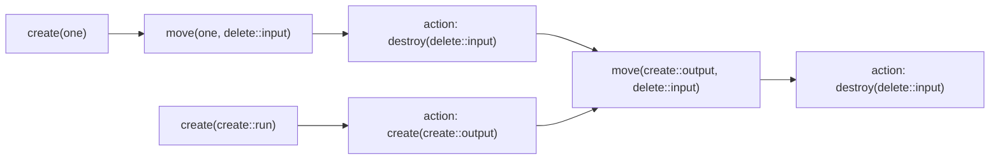

What's interesting here is that we have two parallel actions, and that `move`
statement has to _wait_ for both of them to complete. This situation (a node
with more than one incoming edge in the graph) is called a "join."

Joins are the one place where our Action Splitting mechanics are not sufficient,
by themselves, to guarantee safe concurrency. We need a mechanism to actually
implement joins when we generate code.

The mechanism for joins is very simple. Each join gets a counter of unfinished
incoming edges. Each incoming chain decrements the counter as its last act, and
whichever chain decrements it to zero continues into the join node. On all
modern CPUs, decrementing the counter and checking if it is zero is actually a
single atomic instruction, with no locks and no waiting.

In traditional programming languages, it can be tricky to get this
hardware-level concurrency correct, to the point that my personal advice to
programmers is "never use atomics." However, in Define we only need to get this
right _once_---in our code generator---and then every program written in Define
benefits.

### Child Positions

Operations on parent positions and operations on their child positions depend on
each other, in both directions.

#### Operations on a Child Depend on Operations on the Parent

Any operation on a parent position causes all later operations on transitive
child positions to be dependent upon that operation on the parent position. This
is because a child position only exists at all while a particle occupies its
parent position: wherever the particle goes, its children go with it.

Take these lines of code:

```define
create a particle in position<box>.
move the particle in position<box> to position<basket>.
create a particle in position<basket>::position<inner>.
```

If we treated `position<basket>::position<inner>` as its own unrelated position,
the last line would have no dependencies at all, since no other line ever
mentions that position:

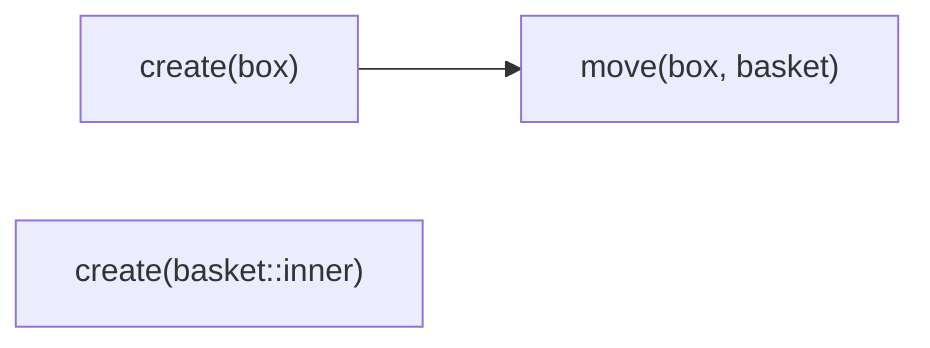

That graph says the create of `position<basket>::position<inner>` could run
first, before anything else, which is wrong: `position<basket>::position<inner>`
doesn't exist until the particle arrives in `position<basket>`. The real graph
has to be a single chain:

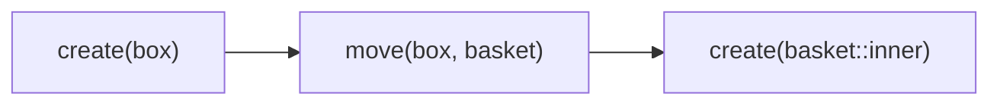

#### Moves and Destroys on a Parent Depend on Operations on Its Children

There is an inverse of the above rule that is also true: any move or destroy on
a parent position depends on the last operation on every transitive child
position beneath it. Destroying a particle also destroys the particles in all of
its child positions. Moving a particle carries the particles in child positions
along with it. Thus, taking those operations a parent particle also logically
performs an operation on every transitive child particle.

Take this code:

```define
create a particle in position<box>.
create a particle in position<box>::position<inner>.
destroy the particle in position<box>.
```

If `position<box>` and `position<box>::position<inner>` were unrelated
positions, we would get this graph:

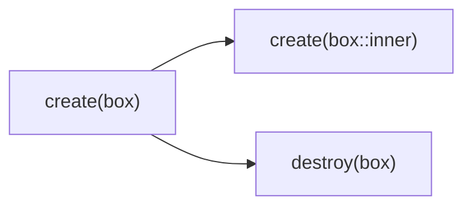

That says we can run the create of `position<box>::position<inner>` in parallel
with the destroy of `position<box>`, which is wrong: the destroy also destroys
the particle in `position<box>::position<inner>`. The real graph is a single
chain:

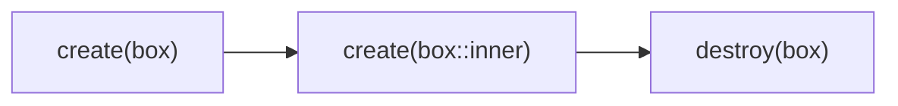

#### Create Statements Never Depend on Operations on Children

For the sake of clarity: create statements on parents cannot possibly depend on
any child position state, since child positions cannot have existed before the
create statement.

This matters when a position is emptied and then filled again:

```define
create a particle in position<box>.
create a particle in position<box>::position<inner>.
destroy the particle in position<box>.
create a particle in position<box>.
create a particle in position<surprise>.
move the particle in position<surprise> to position<box>::position<inner>.
create a particle in position<box>::position<other>.
```

The correct graph here is:

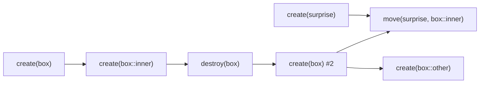

We can see that the move from `position<surprise>` is a parallel action that
feeds only into the _later_ statement on `position<box>::position<inner>`, not
the earlier create on `position<box>::position<inner>`. Of course it does depend
on all the earlier actions, because the create in `position<box>` inherently
creates a dependency chain from the earlier operations on `position<box>` and
its children.

Looking over this example, we see that it actually doesn't create any _new_
rules compared to the above examples; it's simply a natural consequence of the
way our graph works. It's just written here as an interesting point, and also as
a point about designing Define programs for concurrency: most fan-out is sourced
in `create` statements.

### Parallelism Is Not Mandatory

The compiler may choose to _not_ parallelize every concurrent operation. That
is, just because two things _can_ be run at the same time doesn't mean they
_will_ be run at the same time. There are situations in real programs where it
simply doesn't make sense, from a performance and memory perspective, to run
things concurrently. Over time, the compiler's judgment here will improve, to
create more performant Define programs.

In a few cases, we may need to allow the programmer to provide instructions to
the compiler about concurrency in order to maximize optimization, but we should
strive at every turn to make that totally unnecessary.

## A Real Program

Here is a small espresso machine, written as four definitions:

First, `grind.dfn`:

```define
define the potential action<example.com:cafe:/grind> {
    define the position<beans>.
    define the position<grounds>.
    it happens when {
        the position<beans> has a particle.
    } and it does {
        move the particle in position<beans> to position<grounds>.
    }
}
```

Then `heat.dfn`:

```define
define the potential action<example.com:cafe:/heat> {
    define the position<cold_water>.
    define the position<hot_water>.
    it happens when {
        the position<cold_water> has a particle.
    } and it does {
        move the particle in position<cold_water> to position<hot_water>.
    }
}
```

Then `brew.dfn`:

```define
define the potential action<example.com:cafe:/brew> {
    define the position<grounds>.
    define the position<water>.
    define the position<cup>.
    define the position<spent_puck>.
    it happens when {
        the position<water> has a particle.
    } and it does {
        create a particle in position<cup>.
        destroy the particle in position<water>.
        move the particle in position<grounds> to position<spent_puck>.
    }
}
```

And finally `main.dfn`, which ties it all together:

```define
# A tiny espresso machine.
define the potential action<example.com:cafe:/main> {
    it happens when {
        this particle is created.
    } and it does {
        define the position<station> {
            it may only contain particles where {
                it has the action</grind>.
                it has the action</heat>.
                it has the action</brew>.
            }
        }
        create a particle in position<station>.

        # Start grinding and heating.
        create a particle in position<station>::action</grind>::position<beans>.
        create a particle in position<station>::action</heat>::position<cold_water>.

        # Load the brewer. The water goes in last because it is the trigger.
        move the particle in position<station>::action</grind>::position<grounds> to position<station>::action</brew>::position<grounds>.
        move the particle in position<station>::action</heat>::position<hot_water> to position<station>::action</brew>::position<water>.

        # Drink the espresso and throw away the puck.
        destroy the particle in position<station>::action</brew>::position<cup>.
        destroy the particle in position<station>::action</brew>::position<spent_puck>.

        # position<station> is auto-destroyed at the end of the action.
    }
}
```

Here is its execution graph, with the operations inside of the triggered actions
prefixed by the action's name:

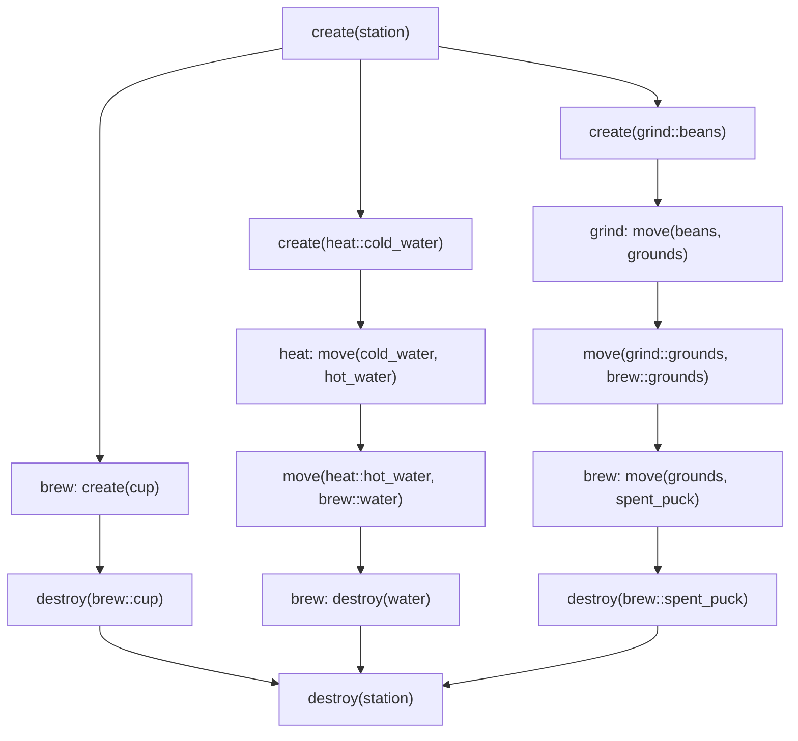

This one graph exercises everything in this proposal:

- **Automatic parallelism.** The grinding chain and the heating chain have no
  dependency on each other, so they run in parallel from the moment the station
  exists, with no instruction from the programmer.
- **Written order is not execution order.** In the source code, the grounds are
  loaded into the brewer before the water, because the water is the trigger and
  the requirement on `position<grounds>` must be satisfied before triggering.
  But there is no edge between those two moves: the two prep chains stay
  parallel all the way into the brewer, and the only operation that waits on the
  grounds is the one inside `action</brew>` that actually needs them.
- **Action splitting.** The last operation `action</brew>` performs on
  `position<cup>` is its very first statement, so the drinker gets the cup while
  the brewer is still destroying the water and ejecting the puck. The compiler
  splits `action</brew>` after its first line.
- **Child positions.** Every chain in the program flows through the particle in
  `position<station>`, so the final destroy of the station depends on the last
  operation on every path through it: the empty cup, the discarded puck, and
  `action</brew>`'s own destroy of the water.
- **Joins.** The graph has exactly one join: the final destroy of the station
  (three edges). That node is the only place in the entire compiled program that
  needs an atomic counter---every other edge is just one function calling
  another.

The program has thirteen operations, but its longest dependency chain is seven
operations long, so almost half of the program's execution overlaps with some
other part of the program.

## Why This is the Right Solution

This puts all the complexities of implementing concurrency into the hands of the
compiler designers and out of the hands of programmers. It provides far more
concurrency in the average program than the programmer would normally write
(provided the compiler judges that the trade-offs are worth it). It proves
concurrency safety at compile time. It depends only on lock-free primitives that
involve no waiting---at least, no waiting on modern CPUs that can do "lock
decrement" along with an automatic memory barrier (x86) or a loose memory model
that allows for safe concurrency in this situation (ARM). Plus, it can all be
verified and compiled modularly with massive parallelism at compile time.

It forces certain good habits into programs, such as duplicating data where you
want true concurrency instead of depending on locks.

It allows for building tools that do some pretty awesome analysis of what's
blocking concurrency in your program and how to make it more concurrent.
Theoretically you could even write automated refactoring tools that
automatically and safely improve the concurrency of code.

Note that while the compiler strives for modularity in compilation, other tools
that seek to do deeper optimization could choose to do more expensive
cross-action analysis for discovering deeper optimizations (as could the
compiler, if we want to do more work in a slower mode).

### Trade-Offs

There are some very serious trade-offs we are making, though, that we should
note here.

#### Opaqueness

Probably the biggest problem with this system is that it is totally opaque to
the developer. Only the compiler can really "explain" what will run
concurrently.

#### Complexity

This does add complexity for all of our future language features, as they all
have to fit into this concurrency model.

#### Lack of Control

In situations where you really want fine-grained control over performance (think
systems-level programming, embedded systems, timing-critical components, etc.)
it's impossible to predict what the compiler will actually _do_ (since its
decisions are based on its own internal understanding of what's optimal). The
minority of developers who have deep understanding of concurrency primitives
could possibly write more efficient code than the Define compiler will naturally
write.

#### Action at a Distance

Changing the code inside of an action has cascading effects on the concurrency
behavior of all of its callers. It doesn't affect the _safety_ of callers, but
it does affect the _runtime behavior_ of them. The one saving grace here is that
this change can be seen purely by compiling the action itself---you can see that
when the contracted positions are last touched changes, in terms of their
position in the graph.

Mostly I suspect this will be fine, as any changes here are essentially
intentional. That is, the developer intended the action to behave differently,
and if they didn't, they can at least _see_ that they made this change and thus
change their mind. In other languages, changing concurrency behavior inside of a
function _also_ has similar cascading effects, but it's much harder to
understand them because you can't trace a DAG of how callers are affected like
you can in Define.

## Forward Compatibility

This is very tricky, for this feature. This is very hard to change our minds
about later, because developers will come to depend on this behavior.
Theoretically, if we wanted to introduce explicit concurrency later and totally
abandon this system, we could rewrite all existing Define programs to use that
explicit concurrency mechanism in a way that exactly follows the semantics of
this proposal, though. After all, this proposal is using just about the simplest
concurrency primitives that exist, at code generation time.

## Refactoring Existing Systems

Define programs written before this proposal (which don't exist in the wild,
only in this repository) don't change in correctness at all, only in runtime
behavior, in a way that is at least theoretically safe.

Refactoring existing concurrency models into this model might be tricky, as it
requires significantly re-ordering the logic of systems such that they comply
with our DAG. In particular, those models require the ability to share a single
memory location across multiple concurrent threads, which Define currently
explicitly forbids, inherently in its design. (That's a pointer, and we don't
have those---intentionally, at the moment.)
