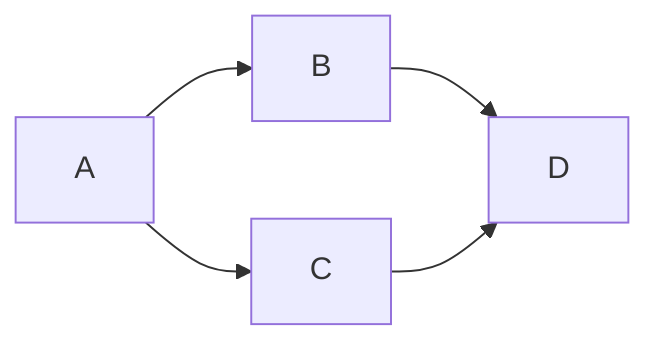

# Define Language Proposal X: Modular Destructor Analysis

- **Author:** Max Kanat-Alexander
- **Status:** Draft
- **Date Proposed:** April 22, 2026
- **Date Finalized:**

## Problems

[DLP 34 (Destructors)](00034-destructors.md) proposes a flexible system of
destructors. However, it creates a particularly tricky set of problems for
modular analysis.

### 1: Called Actions Don't Know About the Parent's Added Destructors

Imagine that in Action A, we have a position named `position<my_file>`with the
qualities `position</file>` and `action</destructor>`, where
`action</destructor>` deletes the file when the dimension point in
`position</file>` is destroyed.

When then take `position<my_file>` and pass it into the interface position of
Action B. That interface position only requires `position</file>`. Thus, Action
B doesn't "know" the destructor exists. When we are analyzing Action B by
itself, Action B doesn't know that the destructor runs and can't check if
running the destructor will create an invalid state in the program.

Generating the runtime code for the destructor isn't too difficult; the program
simply needs to track that a destructor is attached to a dimension point and
execute that destructor when that dimension point is destroyed. However, modular
verification that destruction is safe has potentially very complex computational
cost if not handled correctly.

### 2: Destructor Ordering

[DLP 34 (Destructors)](00034-destructors.md) specifies that destructors are
processed in LIFO order (in reverse order of assignment). This is particularly
important when considering quality-required positions and actions, where the
destructors that were added last _must_ run first because they could depend on
positions that were quality-required.

However, interface positions on actions don't have to specify their constraints
in the same _order_ that the caller did. So how do we know what order the
destructors are going to be run in, at compile time?

### 3: Siblings Will Survive

Imagine that you have a position hierarchy that looks like:

```mermaid
flowchart LR
    A --> B
    A --> C (C (has destructor))
    C --> D
```

When C's destructor runs, it will destroy D and C, but A and B will survive.

Let's imagine that `A` was passed in to an interface position of an action
called `action</clean_room>`, and `action</clean_room>` does
`destroy the dimension point in position<a>::position</c>.` Then later it does
something like:
`move the dimension point in position<a>::position</b> to position<my_local>.`
So it depends on there being a dimension point in B.

Now let's imagine we have a caller called `action</clean_building>` that
triggers `action</clean_room>`. It happens to know that the dimension point in
`position</c>` has an additional destructor on it that will destroy
`position</b>`. Uh oh, that makes `action</clean_room>` unsafe! But
`action</clean_room>` doesn't know about that. Only `action</clean_building>`
knows about it, and it's only true when `action</clean_building>` is the caller!

Essentially the problem is:

1. Destruction of sibling positions is not guaranteed.
2. Other destructors could also affect sibling positions, including destructors
   that are only known about higher up in the call chain.

### 4: Callees Can Make Changes

When verifying a destructor, what matters is the state of positions at the time
of destruction. However, let's go back to the problem of "callees don't know
about destructors their callers added." Only the caller knows that it needs to
verify the destructor, but only the callee knows the actual state of dimension
points at the time of destruction---information that we need in order to verify
the safety of running a destructor. So somehow we need to be able to do modular
analysis even though the necessary information to do it is split into multiple
locations.

## Solution

Each action checks only the destructors that _it_ added. However, it checks them
as though they were running at the moment of destruction, not running inside of
their own action.

Thus, the action that destroys a dimension point verifies any destructors that
_it_ added immediately, acting as though the destructor action was triggered and
ran synchronously.

The complexity of the solution comes in when you have to deal with destructors
that were added by the caller.

### Destruction Contracts

We have to modify the action contract to contain additional data. This is only
relevant for dimension points that that are passed in through interface
positions or that are accessed as quality-required positions in an action.

These additions only occur when an action destroys one of those dimension points
explicitly or automatically.

#### Destruction Fact

Action contracts must contain the information that the relevant dimension point
was destroyed (not just that the interface position is empty, but specifically
that _that_ dimension point got destroyed). This is the only way that a caller
can know to check the verification of destructors that it added.

Destructions must be contained in the contract in the order they were executed,
so that we know that the requirements of later destructions are fulfilled by the
guarantees of earlier destructions.

#### Sibling State

Action contracts must contain the state of any sibling positions of destroyed
dimension points immediately before destruction started. This is needed because
a caller could add a destructor that quality-requires one of those positions and
it will need to know the state of those positions to know whether what it _does_
with those positions is valid.

This must include the state of all known child positions of those siblings as
well.

Because the action that is performing the destruction may not be aware of every
quality on the destroyed dimension point, this state summary must be updated by
every caller in the chain.

Note that there is probably a more memory-efficient version of this possible,
too, where we do a forward pass through the refrence graph that lets actions
know which positions destructors can actually affect, and so callees only have
to return the state of those. (However, if you want to ship a compiled library,
you would have to expose the full data for all sibling positions anyway, since
you can't know what destructors your callers are going to add.)

#### Sibling Required Guarantees

Actions can affect sibling positions after you destroy a position. However,
destructors can also affect sibling positions. So we have a question: what state
do sibling positions affected by the callee (the action that destroyed the
dimension point) have to stay in _after_ destruction in order for safety to be
assured?

Thus, we have to expose a set of "required guarantees." This is just a statement
of what any caller destructors _must_ guarantee (or not affect).

This accumulates transitively as we walk up the call tree. If we have an action
call chain like `Action A --> Action B --> Action C`, and B takes some action on
one of those sibling postions _after_ calling Action C, that information must
appear in the contract of Action B that will be seen by Action A and any other
callers of Action B.

Note that auto-destroyed positions will never generate this and auto-destruction
is thus more efficient than manual destruction.

### The Destructor Verification Algorithm

The heart of destructor verification is "check it as though it were running at
the moment of destruction."

In order to talk about this, we are going to imagine that we have this chain of
action calls:



Action A calls B and C, and both B and C call D. Action D is the one that
contains the statement
`destroy the dimension point in position<interface>::position</child>.` or
something like that.

Analyzing Action D itself is straightforward, as described above. You simply
treat any destructors that were _assigned_ to the dimension point in
`position<interface>::position</child>` inside of Action D as running
immediately upon destruction and analyze action requirements and guarantees for
that destructor. This is simply [DLP 34 (Destructors)](00034-destructors.md).

However, let us imagine that the dimension point in
`position<interface>::position<interface>` was actually created inside of Action
A (which Action D cannot "know" when we are validating action contracts per
[DLP 37 (Automatic Position Presence Constraints)](00037-automatic-position-presence-constraints.md)).

Thus, Action D exposes the additional Action Contract information described
above, which it captures right at the moment of destruction of the dimension
point in `position<interface>::position</child>`. For example, let's imagine it
has a destructor named
`position<interface>::position</child>::action</d_destructor>`.

For example, let's imagine that there is an additional sibling on
`position<interface>` that Action D knows about, called
`position<interface>::position</younger_brother>`. We have to tell the callers
about the state of that position.

Now we look at Action B. Action B could have added a destructor to the dimension
point in Action D's `position<interface>::position</child>`. Let's call the new
destructor `position<interface>::position</child>::action</b_destructor>`.
Action B also knows about another sibling,
`position<interface>::position</older_brother>`. `/b_destructor` could have
interacted with both `/younger_brother` and `/older_brother`.

As such, when Action D is triggered inside of Action B, Action B analyzes the
requirements and guarantees of `/b_destructor` to make sure they are satisfied
by the destruction contract information returned by Action D. It then amends
that destruction contract as the destruction contract for specifically the path
`Action B --> Action D` and exposes that as part of Action B's destruction
contract to Action A. This contains both the requiements and guarantees that
`/b_destructor` added as well as the state of additional sibling positions that
`Action B` knew about. To be clear, it doesn't modify Action D's contract for
every caller, but only for callers of Action B. Action A will still know that it
is Action D that does the destruction, including what line of code does the
destruction (so that it can explain the problem in error messages) but it knows
about this from the viewpoint of Action B.

Now we get to Action A, which created the dimension point and which does not
expose that dimension point back through its own interface positions. However,
it also knows about a new destructor
`position<interface>::position</child>::action</a_destructor>` and a new
sibling, `position<interface>::position</oldest_brother>`. `/a_destructor` could
have referenced `/oldest_brother`, `/older_brother`, or `/youngest_brother`.
Thus, when Action A triggers Action B, it must check the requirements and
guarantees of `/a_destructor` as though it were executed _before_
`/b_destructor` and `/d_destructor` right at the moment of destruction in Action
D, using the destruction contract exposed via `Action B --> Action D`.

However, as Action A is the original creator of this dimension point, it does
not have to amend the destruction contract in any way or expose any further
destruction contract about this dimension point.

For Action C, there are two possible situations:

1. It knows about different siblings and assigned different destructors than
   Action B. In this case, it exposes a new and different destruction contract
   for `Action C --> Action D`.
2. It does not know about any siblings / assign any destructors other than the
   ones that Action D already knew about. In this case, it just re-exposes
   Action D's destruction contract directly instead of making any amendments.
   For the sake of error-message reporting, Action C does "inform" Action A that
   this is the contract for the path `Action C --> Action D`, but it doesn't
   copy any dictionaries or data structures.

### Additional Restrictions on Destructors

`TODO: Handle adding destructors by creating or moving DPs during destruction.`

Destructors may not use quality assignment statements. This would allow them to
assign new destructors to dimension points in quality-required positions beyond
what is specified in position constraints, which leads to some very confusing
and complex semantics that I don't want to implement at this time. We have to
restrict _all_ quality assignment because any quality _could_ quality-require a
destructor.

This restriction may be lifted in the future; at this time it simply creates too
much analysis complexity for the initial implementation.

## A Real Program

## Why This is the Right Solution

First let's talk about why the algorithm works.

To start with, keep in mind that a destructor can only reference
quality-required positions on the _same dimension point_. It can affect only
that dimension point and its children (in particular, the children that the
destructor itself knows exist via constraints---a fact we can determine
statically).

Also keep in mind that a destruction statement is guaranteed to destroy every
dimension point in all of those children and the dimension point itself. This
means that all actions taken on the destroyed position (and its children)
_after_ destruction in Action D are always safe. Destruction returns things to a
fixed, known state---they don't exist. We don't need to reason about the any
guarantees about the dimension point that was destroyed---its guarantee is
always that it no longer exists.

Also, we know the deterministic order in which destructors run: destructors that
were added to a dimension point later always run before destructors that were
added earlier. Last in, first out. Thus, Destructor D always runs before
Destructor B.

This leaves us with only two problems to solve:

1. **During Destruction**: If Action D added a destructor that Action B did not
   have, and Destructor B's requirements are violated by Destructor C running
   first. For example, Destructor D moved a dimension point from some
   quality-required position that Destructor B expects to be filled.
2. **After Destruction**: If Action B's destructor creates a state in _sibling_
   positions that violates later requirements inside of Action D. For example,
   the destructor from Action B moves some dimension point out of a
   quality-required position that Action D's internal code expects to be filled.

## Forward Compatibility

## Refactoring Existing Systems
